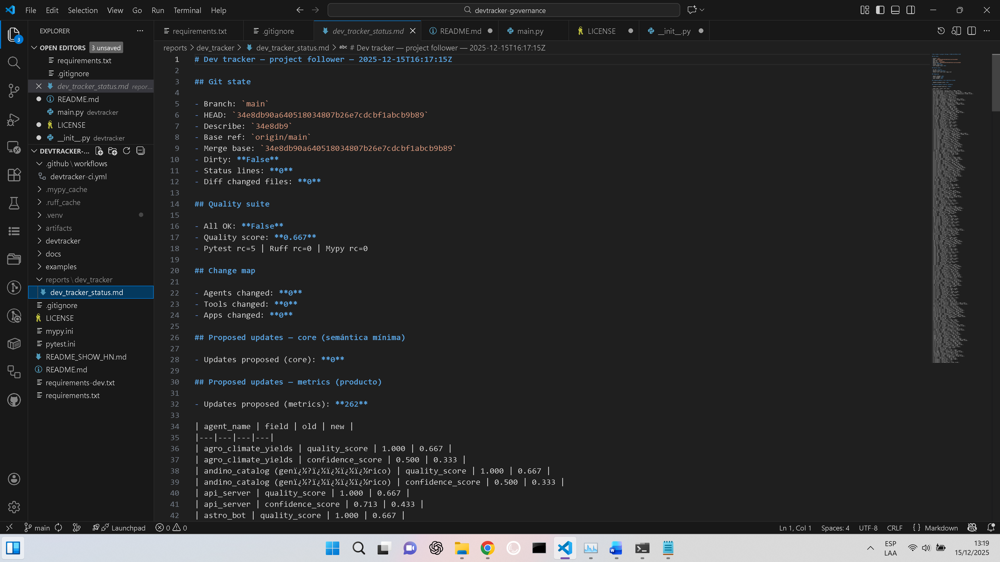
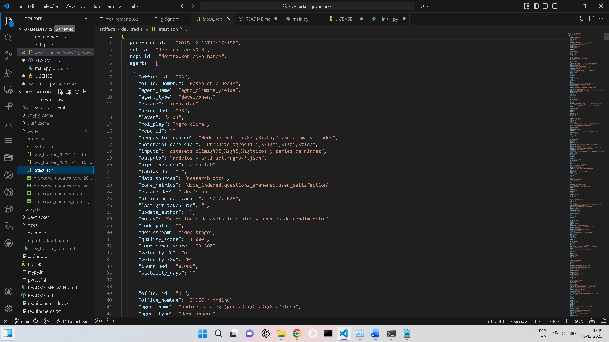

# DevTracker Governance

DevTracker is a lightweight governance and “external memory” layer for human–LLM collaboration.
It audits a Git repository, runs a quality suite, and updates a human-owned tracker (CSV) using strict, auditable rules.

This project is designed for teams building agentic systems where:

- humans define purpose, priority, and semantics;
- automation writes evidence, metrics, and lifecycle signals;
- ownership boundaries are enforced by policy, not vibes.

## What it does

Given:

- a Git repository (this repo or another repo),
- a tracker CSV (the “source of truth” for agent inventory / roadmap / governance),

DevTracker can:

1) **Sanitize** the tracker (single header, canonical delimiter/encoding, schema enforcement).
2) **Audit** changes (git diff + status), producing:
   - JSON artifact (machine-readable run output),
   - Markdown report (human-readable),
   - CSV with proposed updates (reviewable).
3) **Apply** updates under explicit flags:
   - CORE updates (safe governance fields only),
   - METRICS updates (computed fields only).

## Governance model (hard boundaries)

DevTracker enforces three categories of fields:

- **Human-owned fields**: purpose, business meaning, roadmap semantics. DevTracker never edits these.
- **Core mutable fields** (governance evidence): lifecycle, timestamps, audit notes, update_author.
- **Metrics mutable fields**: quality_score, confidence_score, velocity, churn, stability, etc.

This makes the tracker usable as a shared contract between humans and automation.

See:

- `docs/governance_model.md`
- `docs/architecture.md`

## Quickstart

### 1) Install

```bash
pip install -r requirements.txt


## Screenshots

### Audit report (human-readable)


### API-ready snapshot (machine-readable)

